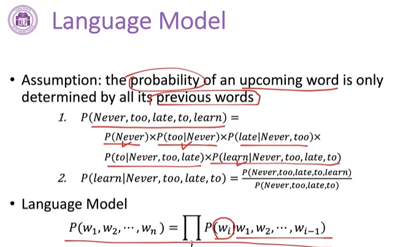
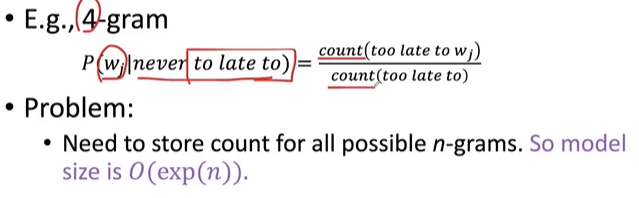
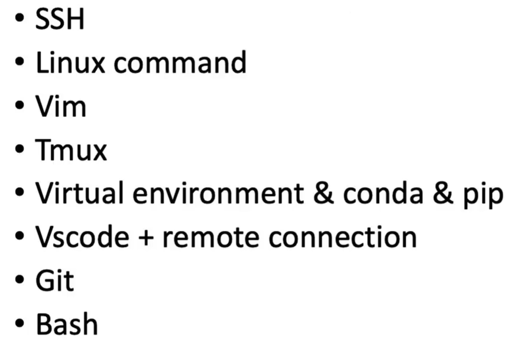
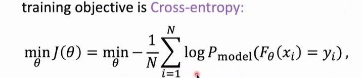
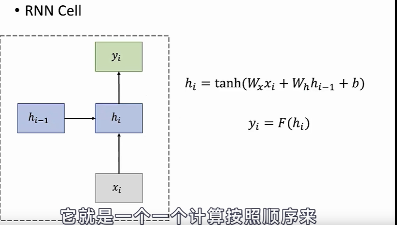
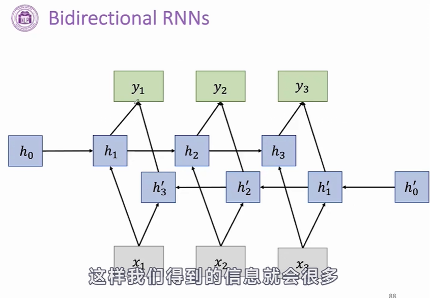
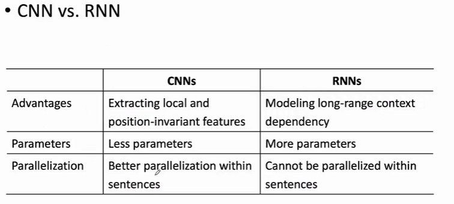

# Big Models Learning Roadmap

## 📘 Basic Knowledge of Big Models
1. [L1 - NLP & Big Model Basics](#l1---nlp--big-model-basics)
2. [L2 - Neural Network Basics](#l2---neural-network-basics)
3. [L3 - Transformer and PLMs](#l3---transformer-and-plms)

## ⚙️ Key Technology of Big Models
4. [L4 - Prompt Tuning & Delta Tuning](#l4---prompt-tuning--delta-tuning)
5. [L5 - Efficient Training & Model Compression](#l5---efficient-training--model-compression)
6. [L6 - Big-Model-based Text Understanding and Generation](#l6---big-model-based-text-understanding-and-generation)

## 🌐 Interdisciplinary Application of Big Models
7. [L7 - Big Models × Biomedical Science](#l7---big-models--biomedical-science)
8. [L8 - Big Models × Legal Intelligence](#l8---big-models--legal-intelligence)
9. [L9 - Big Models × Social Science](#l9---big-models--social-science)

---

## L1 - NLP & Big Model Basics
**Topics:** GPU server, Linux, Bash, Conda, etc.  
**Goal:** Build foundational understanding of NLP systems and computational setup.

#### N-gram model
* Collect statistics about how frequent different n-grams are, and use these to predict next word.

#### Linux Basics

#### Activation func
Sigmoid for binary
Softmax for multi-class classification

#### Training Objective
* minimize Loss function
  * Mean Squared Error 
  * Cross-entropy
    * for class classification, e.g., Sentiment label
      * 
* Stochastic Gradient Descent
* Jacobians matrix
  * chain rule for Jacobians

#### Word2Vec

##### Improving Computational Efficiency

Two main improvement methods for word2vec:
* Negative sampling 负采样
* Hierarchical softmax 分层采样

---

## L2 - Neural Network Basics
**Framework:** [PyTorch](https://pytorch.org)  
**Goal:** Learn neural network fundamentals — layers, loss functions, backpropagation.

### RNN

#### Gradient Problem fro RNN
  * Gradient vanish or explode. 
#### RNN Variants
  Better RNN
* GRU Gated Recurrent Unit - 门控循环单元
* LSTM
* Bidirectional RNNs
  * We want to have an output y depending on the **whole input sequence**
  * E.g., Handwriting recognition, Speech recognition, 对一个部分的理解，可能取决于它的前文和后文
  

### CNN
* Generally used in Computer Vision
* Some promising results in NLP: sentiment classification, relation classification
* Good at extracting local and position-invariant patterns

#### CNN vs. RNN

---

## L3 - Transformer and PLMs
**Library:** [Huggingface Transformers](https://huggingface.co/transformers)  
**Goal:** Understand transformer architecture and pre-trained language models (PLMs).

---

## L4 - Prompt Tuning & Delta Tuning
**Tools:** [OpenPrompt](https://github.com/thunlp/OpenPrompt), [OpenDelta](https://github.com/thunlp/OpenDelta)  
**Goal:** Learn how to efficiently adapt large models via prompt or delta tuning.

---

## L5 - Efficient Training & Model Compression
**Suite:** [OpenBMB suite](https://github.com/OpenBMB)  
**Goal:** Explore techniques for optimizing training and compressing big models.

---

## L6 - Big-Model-based Text Understanding and Generation
**Goal:** Apply large models for text comprehension, reasoning, and generation tasks.

---

## L7 - Big Models × Biomedical Science
**Goal:** Leverage big models for biomedical research, data mining, and knowledge extraction.

---

## L8 - Big Models × Legal Intelligence
**Goal:** Use large models to analyze legal documents, support reasoning, and decision-making.

---

## L9 - Big Models × Social Science
**Goal:** Apply big models in social data analysis, opinion mining, and behavioral modeling.
