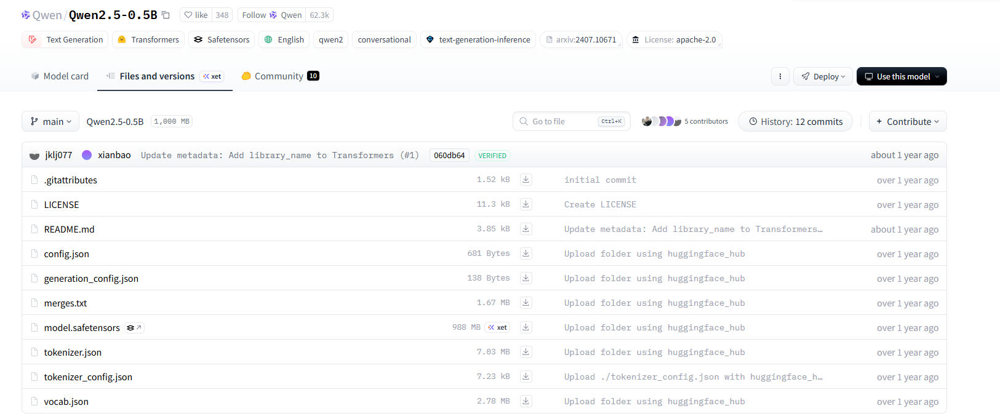

## 快速预训练一个模型

这里我们使用 **Qwen2.5-0.5B** 的模型架构，使用Hugging Face 的Transformers NLP框架，使用 **出门问问序列猴子开源数据集** 的子集作为预训练数据集， 使用 **DeepSpeed** 加速训练， 使用swanlab监控训练流程，完成一次完整的训练。
这样一个模型使用子数据集，在5090上的训练时长是6h。

### 初始化一个LLM
我们可以使用 Transformers 的 AutoModel类 来直接初始化已经实现好的模型, 同时我们也可以使用一个有的模型架构直接初始化， 这里我们用 **Qwen2.5-0.5B** 模型架构为例, 其中 **config.json** 文件即是模型的配置信息，包括模型的架构，隐藏测的大小，模型层数等。


这里我们用[模型下载文件](./download_dataset.py)下载模型, 国内用镜像endpoint会下载快一点。

``` python
import os
os.environ['HF_ENDPOINT'] = 'https://hf-mirror.com'
os.system('huggingface-cli download --resume-download Qwen/Qwen2.5-0.5B --local-dir autodl-tmp/train_a_model/qwen-0.5b')
```

#### 加载模型配置
我们使用AutoConfig加载已经定义好的模型参数，下面也显示相应的config。
```python
# 使用 transformers 的 Config 类进行加载
from transformers import AutoConfig

# 下载参数的本地路径
model_path = "HF_models/qwen-0.5b"
config = AutoConfig.from_pretrained(model_path)
config
```

```text
Qwen2Config {
  "architectures": [
    "Qwen2ForCausalLM"
  ],
  "attention_dropout": 0.0,
  "bos_token_id": 151643,
  "dtype": "bfloat16",
  "eos_token_id": 151643,
  "hidden_act": "silu",
  "hidden_size": 896,
  "initializer_range": 0.02,
  "intermediate_size": 4864,
  "layer_types": [
    "full_attention",
    "full_attention",
    "full_attention",
    "full_attention",
    "full_attention",
    "full_attention",
    "full_attention",
    "full_attention",
    "full_attention",
    "full_attention",
    "full_attention",
    "full_attention",
    "full_attention",
    "full_attention",
    "full_attention",
    "full_attention",
    "full_attention",
    "full_attention",
    "full_attention",
    "full_attention",
    "full_attention",
    "full_attention",
    "full_attention",
    "full_attention"
  ],
  "max_position_embeddings": 32768,
  "max_window_layers": 24,
  "model_type": "qwen2",
  "num_attention_heads": 14,
  "num_hidden_layers": 24,
  "num_key_value_heads": 2,
  "rms_norm_eps": 1e-06,
  "rope_scaling": null,
  "rope_theta": 1000000.0,
  "sliding_window": null,
  "tie_word_embeddings": true,
  "transformers_version": "4.57.3",
  "use_cache": true,
  "use_mrope": false,
  "use_sliding_window": false,
  "vocab_size": 151936
}
```

##### 加载Tokenizer
除了模型的架构，我们还需要初始化一个tokenizer， 这里我们直接使用Qwen-2.5-0.5B的tokenizer参数，
```python
# 加载预训练好的 tokenizer
from transformers import AutoTokenizer

tokenizer = AutoTokenizer.from_pretrained(model_name_or_path)
```
#### 预训练数据集
这里我们用 **出门问问序列猴子开源数据集** 的一部分来训练模型，完整数据集大小约10GB， [下载模型文件](./download_dataset.py), 后续SFT数据集也一切下载了，注意预留 **足够的空间**, 这里我们创建一个小的子数据集，来进行训练。

```python
import json

fw = open("dataset/pretrain_data/mobvoi_seq_monkey_general_open_corpus_small.jsonl", "w")
i = 0
with open("dataset/pretrain_data/mobvoi_seq_monkey_general_open_corpus.jsonl", "r") as f:
    while i <= 1000000:
        line = f.readline()
        fw.write(line)
        i += 1
fw.close()
```

#### 开始训练
执行 pretrain.sh 开始训练
```bash
bash pretrain.sh
```

## 微调一个模型
